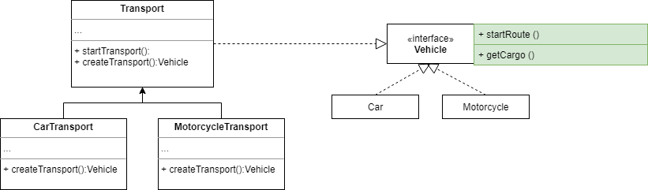
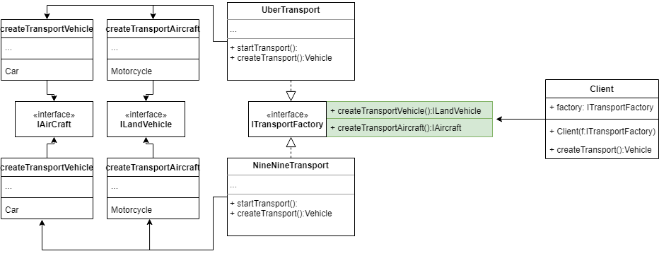

  <i>
    <a href="#Factory Method">Factory Method</a> •
    <a href="#Abstract Factory">Abstract Factory</a> •
    <a href="#Builder">Builder</a> •
    <a href="#Adapter">Adapter</a> •
    <a href="#Bridge">Bridge</a> •
    <a href="#Chain of Responsibility">Chain of Responsibility</a>
  <i/>

## Introdução

Exemplos de design patterns;

## Diagrama

#### Factory Method

#### Abstract Factory
  

#### Builder
  

#### Adapter
  

  
#### Bridge

#### Chain of Responsibility

